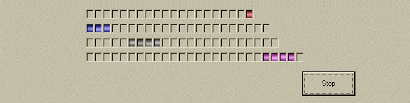



## XP bar liked ocx with gradient

### Description

A simple XP progress bar like with gradient effect
 
### More Info
 
you can set the number of light on by setting the

m_def_NbLedOn property

             |
---                |---
**Submitted On**   |2002-02-12 10:25:28
**By**             |[Francois AUVITY](https://github.com/Planet-Source-Code/PSCIndex/blob/master/ByAuthor/francois-auvity.md)
**Level**          |Intermediate
**User Rating**    |3.7 (11 globes from 3 users)
**Compatibility**  |VB 5\.0, VB 6\.0
**Category**       |[OLE/ COM/ DCOM/ Active\-X](https://github.com/Planet-Source-Code/PSCIndex/blob/master/ByCategory/ole-com-dcom-active-x__1-29.md)
**World**          |[Visual Basic](https://github.com/Planet-Source-Code/PSCIndex/blob/master/ByWorld/visual-basic.md)
**Archive File**   |[XP\_bar\_lik547742122002\.zip](https://github.com/Planet-Source-Code/francois-auvity-xp-bar-liked-ocx-with-gradient__1-31727/archive/master.zip)

